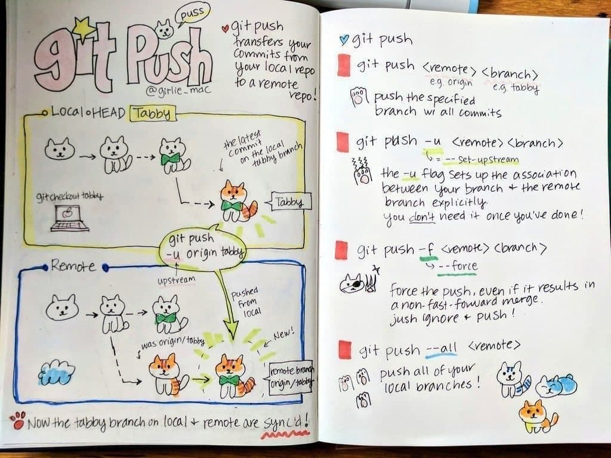

# Инструкция по работе с git репозиторием

**Репозиторий Git** — это виртуальное хранилище проекта. В нем можно хранить версии кода для доступа по мере необходимости.

## Для начала работы:
> git init

Если имя пользователя и почта еще не были заданы:

> git config --global user.name

> git config --global user.email

## Работа с файлами:
Для того, чтобы добавить файл нужно:
1. > git add file_name

    добавляем файл с именем file_name для отслеживания

2. > git commit -m "some message"

   * добавляем текущие изменения в репозиторий и подписываем их с помощью тега -m
   * если добавить тег -а, то к коммиту добавятся все измененные файлы, которые уже отслеживались

    Чтобы отслеживать состояние репозитория:
    1. > git status
    2. > git log

        Чтобы показать ветки:
        > git log --graph

    3. > git diff

Подробнее о командах:

* Команда **git status** выводит список проиндексированных и неотслеживаемых файлов, а также файлов, удаленных из индекса Git.Она показывает, какие изменения были внесены с помощью команд git add и git commit. Сообщения о состоянии также содержат инструкции по индексированию файлов либо отмене этой операции.

* Команда **git log** отображает отправленные снимки состояния и позволяет просматривать и фильтровать историю проекта, а также проводить поиск по ней.Выводит полную историю коммитов в стандартном формате. Если выходные данные занимают более одного экрана, можно выполнить прокрутку с помощью клавиши Пробел или нажать q для выхода.

* Команда **git diff** представляет собой многоцелевую команду Git, которая инициирует функцию сравнения источников данных Git — коммитов, веток, файлов и т. д. 

## Работа с коммитами
Для того, чтобы перейти к определенному коммиту можно использовать команду 
> git checkout 

code_commit - код коммита, к которому хотим перейти, его можно посмотреть в git log

Чтобы вернуться к самому последнему состоянию:
> git checkout master

## Добавление изображений
Чтобы вставить фото или картинку, желательно поместить ее в одну папку с файлом (чтобы было легче указывать к ней путь), 
задаем команду без пробелов восклицательный знак"!" , далее в квадратных скобках [название фото], далее в круглых скобках указываем путь(путь), что по факту является "копированием относительного пути" к файлу

Если изображение находится в другой папке, то указываем путь,начиная с текущего файла,можно добавить ссылку на изображение в интернете
Если картинка не подгрузилась, то отобразится только название из квадратных скобок и иконка фото, 

например так 

## Ветки в git

Чтобы посмотеть все ветки :
> git branch

Для создания новой ветки с именем Branch_name:
> git branch_name

Переместиться к ветке с именем branche_name:
> git checkout branch_name

## Слияние веток и решение конфликтов

Чтобы слить информацию из ветки branch_name в текущую:
> git merge branch_name

В случае конфликта нужно удалить все лишние строки и оставить ту часть, которая нам нужна. Если необходимо, то можно отредактировать ее.

## Удаление веток

Для того, чтобы удалить ветку с именем branch_name:
> git branch -d branch_name

Удаление с игнорированием ошибок:
> git branch -D branch_name

## Справка

Чтобы вызвать справку по команде, допишите тег:
> --help

Примеры применения тега:

 > git add --help

 > git branch --help

# Инструкция для работы с Markdown

## Выделение текста

Чтобы выделить текст курсивом необходимо обрамить его звездочками (*) или знаком нижнего подчеркивания (_). Например, *вот так* или _вот так_.

Чтобы выделить текст полужирным, необходимо обрамить его двойными звездочками (**) или двойным знаком нижнего подчеркивания (__) . Например, **вот так** или __вот так__ 

Альтернативные способы выделения текста жирным или курсивом нужны для того, чтобы мы могли совмещать оба этих способа. 

Например, _текст может быть выделен курсивом и при этом быть **полужирным**_.

## Списки

Чтобы добавить ненумерованные списки , необходимо пункты выделить (*) или знаком +. Например, вот так:

* Элемент 1
* Элемент 2
* Элемент 3
+ Элемент 4

Чтобы добавить нумерованные списки, неодходимо пункты просто пронумеровать. Например, вот так:

1. Первый пункт
2. Второй пункт
