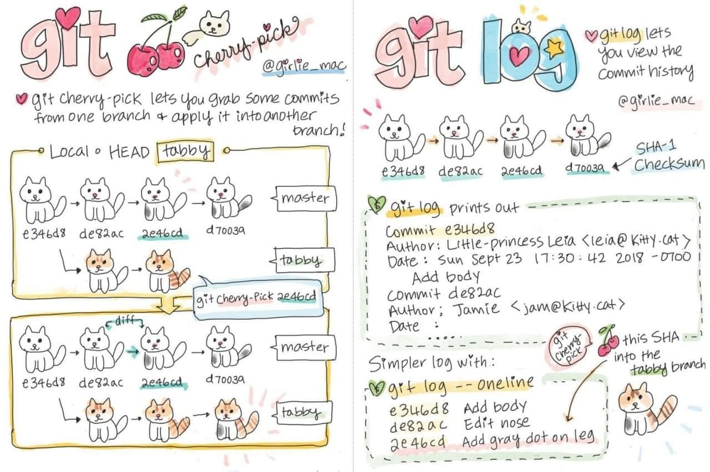

# Инструкция по работе с git репозиторием

**Репозиторий Git** — это виртуальное хранилище проекта. В нем можно хранить версии кода для доступа по мере необходимости.

## Для начала работы:
git init

Если имя пользователя и почта еще не были заданы:

git config --global user.name

git config --global user.email

## Работа с файлами:
Для того, чтобы добавить файл нужно:
1. git add file_name

    добавляем файл с именем file_name для отслеживания

2. git commit -m "some message"

   * добавляем текущие изменения в репозиторий и подписываем их с помощью тега -m
   * если добавить тег -а, то к коммиту добавятся все измененные файлы, которые уже отслеживались

    Чтобы отслеживать состояние репозитория:
    1. git status
    2. git log
    3. git diff

Команда **git log** отображает отправленные снимки состояния и позволяет просматривать и фильтровать историю проекта, а также проводить поиск по ней.

## Работа с коммитами
Для того, чтобы перейти к определенному коммиту можно использовать команду 
git checkout 

code_commit - код коммита, к которому хотим перейти, его можно посмотреть в git log

Чтобы вернуться к самому последнему состоянию:
git checkout master

## Добавление изображений
Чтобы вставить фото или картинку, желательно поместить ее в одну папку с файлом (чтобы было легче указывать к ней путь), 
задаем команду без пробелов восклицательный знак"!" , далее в квадратных скобках [название фото], далее в круглых скобках указываем путь(путь), что по факту является "копированием относительного пути" к файлу

Если изображение находится в другой папке, то указываем путь,начиная с текущего файла,можно добавить ссылку на изображение в интернете
Если картинка не подгрузилась, то отобразится только название из квадратных скобок и иконка фото, 

например так 

## Команда git--help 
эта команда помогает вызвать подсказку со списком всех команд в git, расшифровывает, что каждая обозначает и для чего нужна. 
